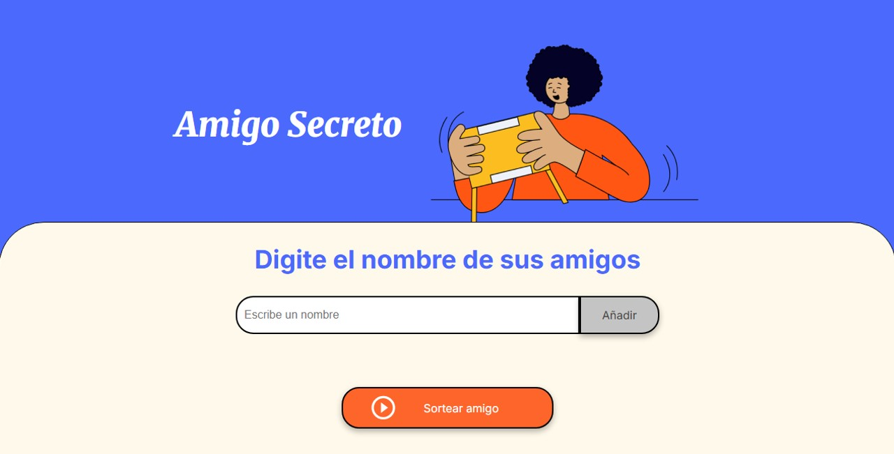

# Alura G9 Challenge 🎁 Amigo Secreto

Mi actividad de One G9 sobre el Challenge Amigo Secreto.



## Index

## ¿Qué hace el juego Amigo Secreto?

- Ingresa los nombres de tus amigos participantes
- El sorteo es aleatorio
- ¡Descubre quién es tu amigo secreto!

## 💡 ¿Cómo funciona el juego Amigo Secreto?

1. Escribe los nombres de tus amigos uno a uno en el campo de texto
2. Haz clíck en el boton añadir y en pantalla apareceran los nombres de tus amigos participantes
3. Una vez agregados todos tus amigos, presiona el botón "Sortear amigo"
4. El juego muestra el resultado del nombre del amigo ganador

## 🧩 Características del juego Amigo Secreto?

- 🎯 El sistema elegirá al azar al "Amigo Secreto"
- 📝 El juego no acepta duplicar nombres, pero el sistema te alerta en caso de 
- 📝 El juego acepta nombres acentuados
- 📝 No se aceptan nombres invalidos, espacios en blanco o caracteres diferentes a letras
- 📝 Puedes corregir en caso de ingresar caracteres inválidos el sistema te alerta para ello

¡Te invito a que utilices el juego y tengas una forma efectiva de sortear a tu Amigo Secreto!

## Archivos del Juego Amigo Secreto

- `index.html` - página web
- `style.css` - estilos y diseño
- `app.js` - código java y lógica del sorteo
- `assets/` - imágenes

## Cómo ejecutar el Juego Amigo Secreto?

### Opción 1: Descarga

1. Descarga todos los archivos
2. Doble-clíck en `index.html`
3. Listo! Puedes ejecutar en tu navegador favorito

### Opción 2: Desde GitHub

1. Clonar o descargar el repositorio
   ```bash
   git clone https://sagitario-mx.github.io/Challenge-Amigo-Secreto.git
2. Abrir la Carpeta del Challenge-Amigo-Secreto
3. Doble-click en `index.html`

### Opción 3: Pruébalo directamente dando click sobre el enlace

    https://sagitario-mx.github.io/Challenge-Amigo-Secreto/


## ⚙️ Tecnologías Utilizadas

    🧱 HTML5 — Estructura semántica y contenido

    🎨 CSS3 — Estilo y diseño visual

    ⚡ JavaScript — lógica de programación Java Script

    📦 Git — control de versiones y colaboración

## Aprendizaje durante el desarrollo del Challenge Amigo Secreto

    - Manejo de HTML, sorteo y manejo dinámico del DOM
    - Procesos de Validación user input
    - Crear listas dinámicas
    - Generate random numbers
    - Style a web page

## Possible future improvements

    - 💾Guardar la lista para usar posteriormente
    - 📝Eliminar usuarios de la lista
    - 🎉Sorteos Múltiples
    - 📱 Version Móvil Responsiva
    - 🌙 Tema Obscuro
    - 🔉 Efectos de Sonido

## Créditos

## 👨‍💻 Autor

y2k4@hotmail.com
GitHub: Sagitario-Mx 

Proyecto desarrollado durante el reto **Alura** Challenge Amigo Secreto

---

*Uff! es mi primer proyecto de Java Script* 😉

